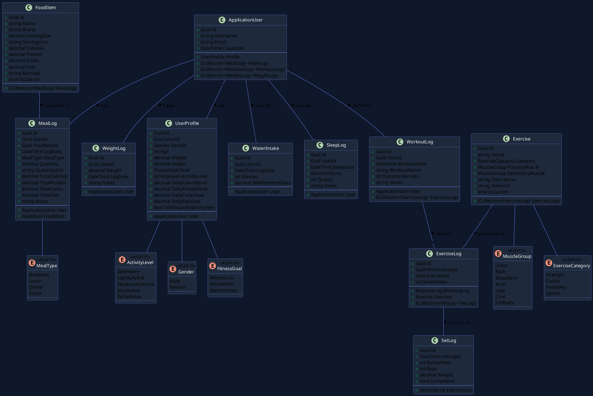
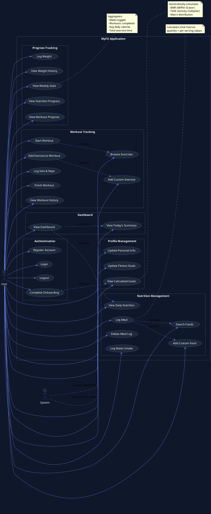
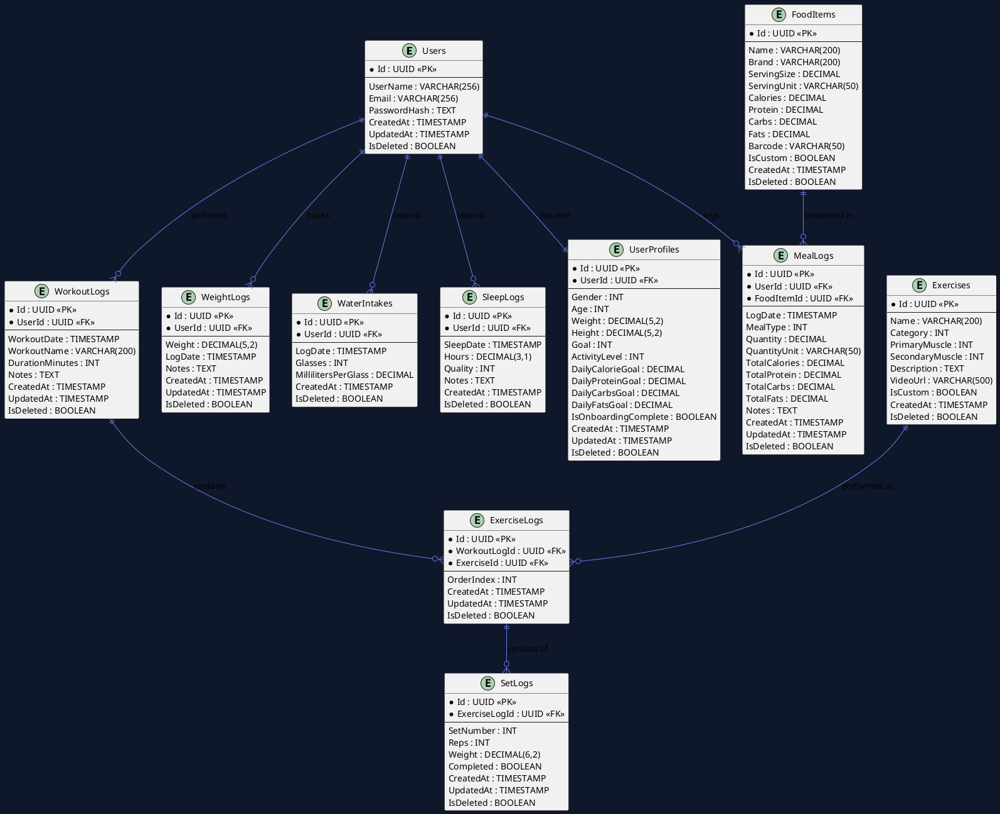
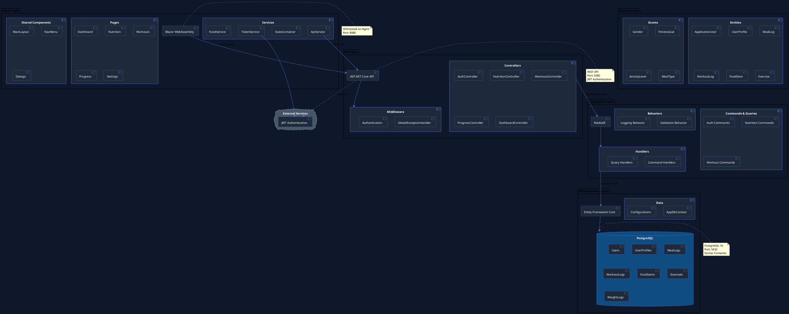

# MyFit System Diagrams

## Class Diagram



## Sequence Diagram - User Registration & Meal Logging

```plantuml
@startuml MyFit Sequence Diagram

!define USER_COLOR #667eea
!define CLIENT_COLOR #10b981
!define API_COLOR #3b82f6
!define DB_COLOR #f59e0b

skinparam backgroundColor #0f172a
skinparam sequence {
    ArrowColor #667eea
    ActorBorderColor #667eea
    ActorBackgroundColor #1e293b
    ActorFontColor #f8fafc
    ParticipantBorderColor #667eea
    ParticipantBackgroundColor #1e293b
    ParticipantFontColor #f8fafc
    LifeLineBorderColor #475569
    LifeLineBackgroundColor #1e293b
}

actor User as U
participant "Blazor Client" as C
participant "API Controller" as A
participant "MediatR" as M
participant "Database" as D

== User Registration ==
U -> C: Navigate to Register
activate C
C -> C: Display registration form
U -> C: Enter credentials\n(email, password)
C -> A: POST /api/auth/register
activate A
A -> A: Validate input
A -> D: Create ApplicationUser
activate D
D --> A: User created
deactivate D
A -> A: Generate JWT token
A --> C: Return token & user
deactivate A
C -> C: Store token in localStorage
C --> U: Redirect to dashboard
deactivate C

== Profile Setup (Onboarding) ==
U -> C: Navigate to Settings
activate C
C -> A: GET /api/auth/profile
activate A
A -> D: Query UserProfile
activate D
D --> A: Profile data
deactivate D
A --> C: Profile info
deactivate A
C -> C: Display onboarding form
U -> C: Enter profile data\n(age, weight, height, goals)
C -> C: Calculate BMR & TDEE\n(Mifflin-St Jeor equation)
C -> A: POST /api/auth/onboarding
activate A
A -> D: Create/Update UserProfile
activate D
D --> A: Profile saved
deactivate D
A --> C: Success response
deactivate A
C --> U: Show confirmation
deactivate C

== Log Meal ==
U -> C: Navigate to Nutrition
activate C
C -> A: GET /api/nutrition/today
activate A
A -> D: Query today's meals
activate D
D --> A: Meal list
deactivate D
A --> C: Daily nutrition data
deactivate A
C -> C: Display dashboard\nwith progress bars
U -> C: Click "Log Meal"
C -> C: Open meal dialog
U -> C: Search for food\n(e.g., "chicken")
C -> A: GET /api/nutrition/foods/search?q=chicken
activate A
A -> D: Search FoodItems
activate D
D --> A: Matching foods
deactivate D
A --> C: Food results
deactivate A
C -> C: Display food list
U -> C: Select food & quantity
U -> C: Select meal type (Breakfast)
C -> C: Calculate total macros\n(quantity × per-serving values)
C -> A: POST /api/nutrition/log-meal
activate A
A -> M: Send LogMealCommand
activate M
M -> D: Insert MealLog
activate D
D --> M: Meal logged
deactivate D
M --> A: Success
deactivate M
A --> C: Meal logged successfully
deactivate A
C -> A: GET /api/nutrition/today
activate A
A -> D: Query updated meals
activate D
D --> A: Updated meal list
deactivate D
A --> C: Refreshed data
deactivate A
C -> C: Update UI & progress bars
C --> U: Show updated dashboard
deactivate C

== Log Workout ==
U -> C: Navigate to Workouts
activate C
C -> A: GET /api/workouts/exercises
activate A
A -> D: Query exercises
activate D
D --> A: Exercise list
deactivate D
A --> C: Exercises
deactivate A
U -> C: Click "Start Workout"
C -> C: Create new WorkoutLog
U -> C: Add exercise (e.g., Bench Press)
C -> C: Add to exercise list
U -> C: Log sets (4x8 @ 80kg)
loop For each set
    U -> C: Enter reps & weight
    C -> C: Add to set list
end
U -> C: Click "Finish Workout"
C -> A: POST /api/workouts/log
activate A
A -> D: Insert WorkoutLog\n+ ExerciseLogs\n+ SetLogs
activate D
D --> A: Workout saved
deactivate D
A --> C: Success
deactivate A
C --> U: Show confirmation
deactivate C

== Track Progress ==
U -> C: Navigate to Progress
activate C
C -> A: GET /api/progress/weight
activate A
A -> D: Query WeightLogs
activate D
D --> A: Weight history
deactivate D
A --> C: Weight data
deactivate A
C -> A: GET /api/progress/weekly-stats
activate A
A -> D: Aggregate last 7 days
activate D
D --> A: Stats (meals, workouts, calories)
deactivate D
A --> C: Weekly summary
deactivate A
C -> A: GET /api/progress/nutrition
activate A
A -> D: Query daily nutrition
activate D
D --> A: 7-day nutrition data
deactivate D
A --> C: Nutrition progress
deactivate A
C -> C: Display charts\n& statistics
C --> U: Show progress overview
deactivate C

@enduml
```



## Use Case Diagram



## Entity Relationship Diagram



## Architecture Diagram



## How to Use These Diagrams

1. **Online PlantUML Editor**: 
   - Visit: https://www.plantuml.com/plantuml/uml/
   - Copy and paste any diagram code
   - Click "Submit" to generate

2. **VS Code Extension**:
   ```bash
   # Install PlantUML extension
   code --install-extension jebbs.plantuml
   ```
   - Create a `.puml` file
   - Paste the diagram code
   - Press `Alt+D` to preview

3. **PlantUML CLI** (requires Java):
   ```bash
   # Install PlantUML
   choco install plantuml
   
   # Generate PNG
   plantuml diagram.puml
   ```

4. **Markdown Preview**:
   - Many markdown viewers support PlantUML
   - Use code blocks with ```plantuml
